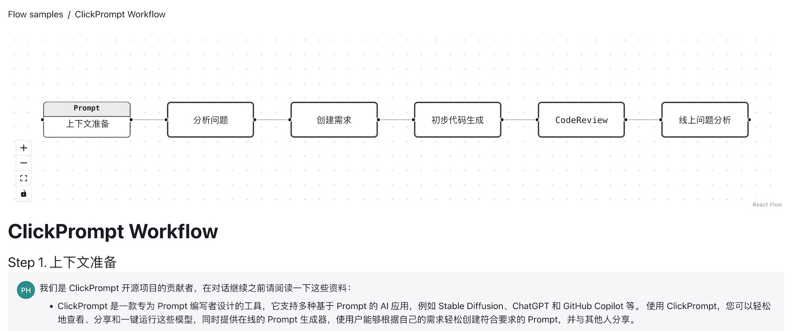

# ChatFlow - 打造个性化 ChatGPT 流程，构建自动化之路

Screenshots:

Online Demo: https://prompt.phodal.com/

[English](./README.md) | 简体中文

# 部署

## 在 Vercel 上部署 ChatFlow，使用 Planetscale

按照以下步骤，在 Vercel 上部署 ChatFlow，使用由 Planetscale 提供的无服务器 MySQL 数据库：

1.  从 GitHub 克隆 [ChatFlow 模板](https://github.com/prompt-engineering/chat-flow)。
2.  创建 Vercel 帐户，并将其连接到 GitHub 帐户。
3.  创建 [Planetscale](https://app.planetscale.com) 帐户。
4.  设置 Planetscale 数据库：
    1.  使用 `pscale auth login` 登录 Planetscale 帐户。
    2.  使用 `pscale password create <DATABASE_NAME> <BRANCH_NAME> <PASSWORD_NAME>` 创建密码。
    3.  使用 `npx prisma db push` 将数据库推送到 Planetscale。
5.  配置 Vercel 环境：
    - 设置 Planetscale 数据库的 URL：`DATABASE_URL='mysql://{user}:{password}@{host}/{db}?ssl={"rejectUnauthorized":false&sslcert=/etc/ssl/certs/ca-certificates.crt}'`。
    - 使用 `node scripts/gen-enc.js` 生成加密密钥，并将其设置为 `ENC_KEY`。

完成这些步骤后，您的 ChatFlow 将在 Vercel 上部署，并使用 Planetscale 的 Serverless MySQL 数据库。

## 本地搭建

1. 从 GitHub 克隆 [ChatFlow 模板](https://github.com/prompt-engineering/chat-flow)。
2. 暂时仍依赖 Planetscale 服务，按照上小节注册，并配置`DATABASE_URL`到.env 文件。
3. 执行 `npm install`。
4. 使用 `node scripts/gen-enc.js` 生成加密密钥，在 `.env` 文件中配置 `ENC_KEY=***` 的形式。（PS：`.env` 文件可以从 env.template 复制过去）
5. 直接运行 `npm run dev` 就可以使用了。

# Create new Flow

- examples: see in: [src/assets/chatgpt/flow](src/assets/chatgpt/flow)
- all type defines: [src/flows/types](src/flows/types)

# Development

Technical documentation:

- Flowchart
  - DotParser, parse dot file to graph data
  - dagre, layout graph data
  - ReactFlow, render graph data
- Flow Functions
  - jsonpath-plus, parse jsonpath
  - expr-eval, parse expression
- Flow Components
  - JsonViewer, render json data
  - DataTable, render table data
- Flow Editor
  - ReactFlow, render graph data
- Repl Server
  - Rx.js, handle websocket
- Others
  - MarkdownViewer, render markdown data
  - MermaidViewer, render mermaid data

## LICENSE

This code is distributed under the MIT license. See [LICENSE](./LICENSE) in this directory.
